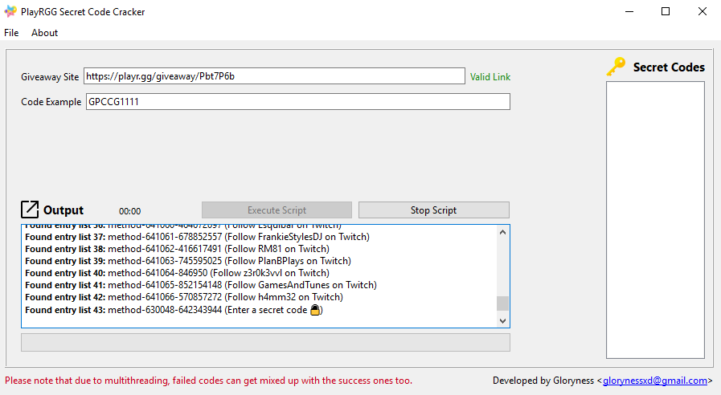

<p align="center">
  <a></a>
  <h3 align="center">PlayrGG Secret-Code Cracker</h3>
  <p align="center">
    Bruteforce attack to crack secret-codes.
    <br />
    <br />
    <a href="https://github.com/Gloryness/playrcc/issues">Report Bug</a>
    ·
    <a href="https://github.com/Gloryness/playrcc/issues">Request Feature</a>
    ·
    <a href="https://github.com/Gloryness/playrcc/pulls">Send a Pull Request</a>
  </p>
</p>

#

# Note

This repository was originally private due to the nature of it. However, I created this 2 years ago and by now it is out of date and presumeably does not work due to how I've seen how secret codes are distributed now (way better than before).
Therefore I decided to make it public for anyone that wants to use it for educational-purposes.

---------------------------------------------------------------

Based on the Giveaway site https://playr.gg/ and is used to crack secret-codes.

WARNING: Please do not overspam it as you can get banned for it. If this is the case, please create an Isssue and I can solve this and set up a new account.

# Installation

Python 3.8+ recommended.

Install latest version from git repository using pip:
```bash
$ pip install git+https://github.com/Gloryness/playrcc.git
```

Clone the repo using git:
```bash
$ git clone https://github.com/Gloryness/playrcc.git
```

<a href="https://github.com/Gloryness/playrcc/raw/master/playrcc/exe/PlayrGG%20Secret-Code%20Cracker.zip">Download the .exe version</a>

# How To Use

**NOTE**: If you wish to use the command-line text based version, then run `code-cracker.py` instead.
Use `code-cracker.py -h` for a list of commands because it uses **selenium** for automation.
Note: It runs much slower the text based version since it counts up to e.g 1-1000 with only 1 thread.

- Run `main.py` if your using the source code version.
- Enter the playr.gg link in the first text entry.
- If you want, enter a already known secret-code to speed up the process, or you can simply enter a code you want to test.
  Please make sure the code has a pattern to it, for example: (code123, 123code, PLAYRGG1241)

- Execute the script!

# View


